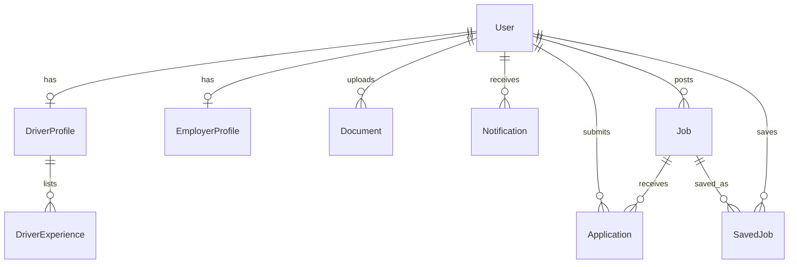

# 🚚 Driver Hub

A job portal built for **driver recruitment**. Drivers find and apply for jobs, employers post vacancies and hire, and admins moderate the platform. Available as a **responsive web app** and an **Android app** (Capacitor).

| | |
|---|---|
| 🌐 **Web app** | https://driver-hub-phi.vercel.app |
| ⚙️ **API** | https://driver-hub-vw8f.onrender.com/api |
| 📱 **Android APK** | https://drive.google.com/file/d/1k3x0ygD4YPJCP-iazNwOwyzmtkIwbarL/view?usp=sharing |
| 💻 **Source** | https://github.com/NehaRajkumarPatil/driver-hub |

> **Note:** the API runs on a free Render instance, so the first request after inactivity can take up to a minute. Open `/api/health` once to wake it.

## 🔑 Demo logins

| Role | Email | Password |
|---|---|---|
| Driver | `jamie@driverhub.com` | `Driver@123` |
| Employer | `hiring@northstarfreight.com` | `Employer@123` |
| Admin | `admin@driverhub.com` | `Admin@123` |

You can also register new Driver and Employer accounts. Admin accounts cannot be self-registered.

## ✨ Features

**Drivers**
- Register, log in, and manage a profile (licence details, skills, experience)
- Upload documents (resume, licence, ID proof)
- Search and filter jobs by keyword, category, location, salary and experience
- View job details, apply, and save jobs
- Track application status (Applied, Viewed, Shortlisted, Rejected, Hired)
- Notifications for application updates and new matching jobs

**Employers**
- Register, log in, and manage a company profile
- Post jobs with category, experience, location, salary, working hours, vacancies and required documents
- View applicants per job and shortlist, reject or hire
- Contact details are revealed only for shortlisted candidates
- Search public driver profiles
- Notifications for job approval and new applications

**Admin**
- Dashboard with platform statistics
- Manage candidates and employers (block / unblock)
- Manage jobs (approve / reject / block); new jobs start as `PENDING`
- View all applications

## 🧱 Tech stack

| Layer | Technology |
|---|---|
| Web client | React, TypeScript, Vite |
| Android | Capacitor (same codebase as the web client) |
| API | Node.js, Express, TypeScript |
| Database | PostgreSQL (Neon) with Prisma ORM |
| Auth | JWT, bcrypt password hashing, role-based access control |
| Validation | Zod |
| Hosting | Vercel (web), Render (API), Neon (database) |

## 🗂️ Project structure

```
Driver_Hub/
├── client/                 React + Vite app and Capacitor Android project
│   ├── src/
│   └── android/
├── server/                 Express API
│   ├── prisma/             schema, migrations, seed script
│   ├── src/                routes, controllers, services, middleware
│   ├── tests/
│   └── requests.http       sample API requests (REST Client)
├── render.yaml             Render deployment config
└── package.json            npm workspace root
```

## 🗄️ Database design



Main tables: `User` (role: DRIVER / EMPLOYER / ADMIN, status: ACTIVE / BLOCKED), `DriverProfile`, `DriverExperience`, `Document`, `EmployerProfile`, `Job`, `Application` (unique per job and driver), `SavedJob`, `Notification`. Full definitions are in `server/prisma/schema.prisma`.

## 🔌 API overview

All routes are prefixed with `/api` and return consistent JSON.

| Area | Endpoints |
|---|---|
| Auth | `POST /auth/register`, `POST /auth/login`, `GET /auth/me` |
| Driver | `GET/PUT /driver/profile`, `/driver/experience` CRUD, `POST/GET/DELETE /documents` |
| Jobs | `GET /jobs` (filters + pagination), `GET /jobs/:id`, `POST /jobs/:id/apply`, `POST/DELETE /jobs/:id/save`, `GET /saved-jobs`, `GET /applications/me` |
| Employer | `GET/PUT /employer/profile`, `/employer/jobs` CRUD, `GET /employer/jobs/:id/applications`, `PATCH /applications/:id/status`, `GET /employer/drivers`, `GET /employer/applications/:id/contact` |
| Notifications | `GET /notifications`, `PATCH /notifications/:id/read`, `PATCH /notifications/read-all` |
| Admin | `GET /admin/stats`, `GET /admin/users`, `PATCH /admin/users/:id/status`, `GET /admin/jobs`, `PATCH /admin/jobs/:id/status`, `GET /admin/applications` |

## 🔒 Security highlights

- Passwords hashed with bcrypt; JWT access tokens
- Role checks on every protected route; blocked users are denied on every request
- Employers can only access their own jobs and applications; drivers only their own data
- Driver contact details are hidden until an application is shortlisted
- Public driver search never exposes email or phone
- Admin role cannot be self-registered

## 🚀 Run locally

Requirements: Node.js 20+, and a PostgreSQL database (a free Neon project works).

```powershell
npm install
Copy-Item server/.env.example server/.env
Copy-Item client/.env.example client/.env
```

Edit `server/.env`:

```
DATABASE_URL="postgresql://..."
JWT_SECRET="a-random-string-of-32-or-more-characters"
CLIENT_ORIGIN=http://localhost:5173
```

Edit `client/.env`:

```
VITE_API_URL=http://localhost:4000/api
```

Then set up the database and start both apps:

```powershell
npm run db:generate
npm run db:deploy
npm run db:seed
npm run dev:all
```

The web app runs at http://localhost:5173 and the API at http://localhost:4000. Run the API tests with `npm test`.

## ☁️ Deployment

1. **Neon:** create a PostgreSQL project and copy the connection string.
2. **Render (API):** create a Web Service from this repo with these settings.
   - Build: `npm install --include=dev && npx prisma generate --schema server/prisma/schema.prisma && npm run build --workspace server && npx prisma migrate deploy --schema server/prisma/schema.prisma`
   - Start: `npm run start --workspace server`
   - Environment variables: `DATABASE_URL`, `JWT_SECRET`, `CLIENT_ORIGIN` (the Vercel URL, no trailing slash, comma-separated for several origins), `NODE_ENV=production`
3. **Vercel (web):** import the repo with Root Directory `client`. Set `VITE_API_URL=https://<your-render-service>.onrender.com/api`, then redeploy.

The server also allows the Capacitor origins `https://localhost` and `capacitor://localhost` so the Android app can reach the API.

## 📱 Build the Android APK

The Android app is the same React client wrapped with Capacitor, pointing at the deployed API through `client/.env.production`.

```powershell
cd client
npm run build
npx cap sync android
```

Then open `client/android` in Android Studio and choose **Build > Generate App Bundles or APKs > Generate APKs**. Or from the command line:

```powershell
cd client/android
.\gradlew.bat assembleDebug
```

The APK is created at `client/android/app/build/outputs/apk/debug/app-debug.apk`.

## ⚠️ Known limitations

- Uploaded documents are stored on the API server's disk through a replaceable storage helper. On free hosting they can be cleared on redeploy; the helper can be swapped for Cloudinary or S3.
- The Render free tier sleeps when idle, so the first request can be slow.
- Notifications are in-app only (no email or push).
